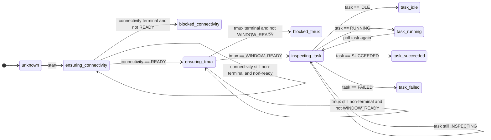
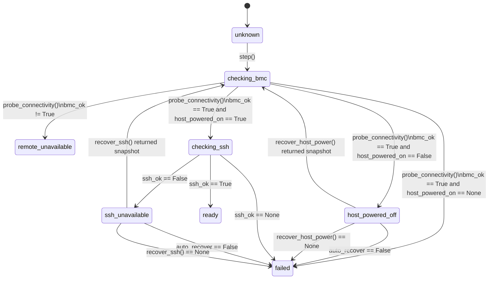
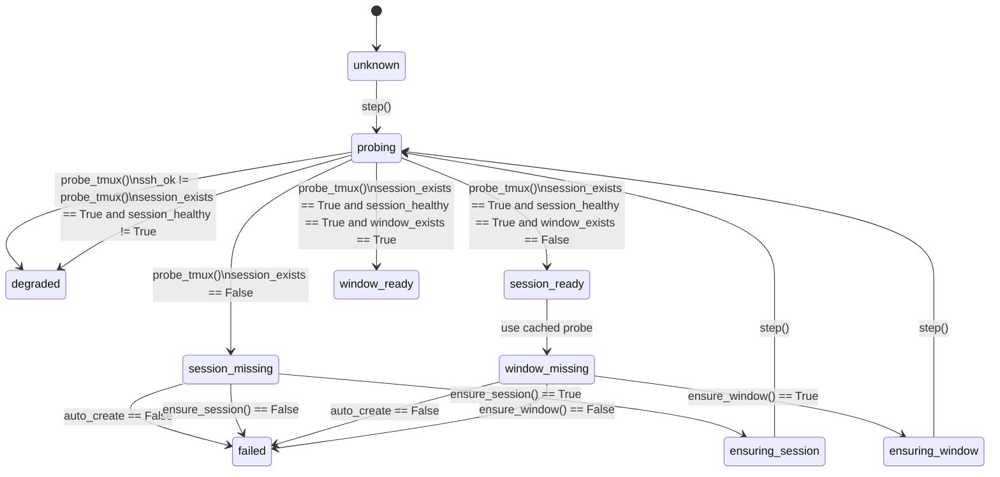
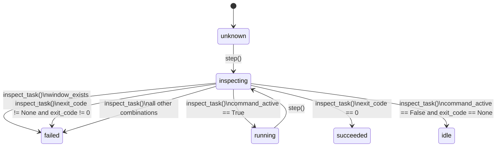

# Remote Server Toolkit

A comprehensive toolkit for remote server management and control, designed for AI-driven workflows and distributed experiments.

## Overview

This toolkit provides a unified interface for managing remote servers through multiple control mechanisms:

- **Tmux Session Management**: Persistent terminal sessions with AI-friendly non-interactive control
- **BMC Control** (Planned): Hardware-level server management (power, reset, console)
- **Extensible Architecture**: Easy to add new control mechanisms (harness suites, monitoring, etc.)

## Current Features

### Tmux Session Manager

Manage persistent tmux sessions on remote servers with:

- **Profile-based Configuration**: Define multiple server profiles
- **Persistent Sessions**: Sessions survive disconnections
- **Task Isolation**: Separate tmux windows for different tasks
- **AI-Friendly Control**: Non-interactive `send` and `capture` commands
- **Multiple Access Methods**:
  - Local CLI for status and output capture
  - Interactive tmux attachment
  - Remote manual access

### Remote Gateway

The toolkit also exposes a higher-level remote gateway that combines:

- SSH reachability probing
- tmux session status inspection
- optional BMC-backed recovery
- heartbeat-style state monitoring

This layer is intentionally workflow-agnostic. It answers "is the remote host
ready for the caller's next action?" but does not encode project-specific
semantics such as kernel versions, sysctl names, or benchmark policies.

## Remote State Machines

The toolkit now models remote control as three independent machines instead of
one mixed graph:

1. `connectivity`: BMC/SSH readiness and host recovery
2. `tmux`: session/window availability once connectivity is ready
3. `task`: command execution state once a target window is ready

The dependency chain is strict:

```text
connectivity ready -> tmux window ready -> task inspection/running/result
```

That separation is deliberate:

- connectivity does not talk about tmux windows or command exit codes
- tmux does not decide whether a task is running or successful
- task does not own BMC/SSH recovery

For external callers, the toolkit also exposes a thinner top-level orchestration
state machine. It only shows which subsystem currently owns progress:

### External Orchestration State Machine



This is the public interaction graph:

- `blocked_connectivity` means tmux and task layers never got ownership.
- `blocked_tmux` means connectivity was ready, but tmux failed to prepare a window.
- `task_*` states mean both connectivity and tmux prerequisites have already succeeded.

### Connectivity State Machine



Key simplification:

- Connectivity only cares about two things: `BMC` and `SSH`.
- `remote_unavailable` means BMC itself is unreachable, so upper layers should stop and inspect BMC connectivity first.
- The old `waiting_*` states are gone. Waiting is now an implementation detail of `recover_host_power()` or `recover_ssh()`, which return a fresh snapshot or fail.

### Tmux State Machine



### Task State Machine



Code reference:

- `remote_server/state_machine.py` defines the three machines, their specs, and the explicit `step()` selection structures.
- Callers should compose these machines in order instead of inventing a mixed remote workflow graph in project code.

## Installation

### As a Git Submodule (Recommended)

```bash
# In your project
git submodule add https://github.com/InitialMoon/remote-tmux-manager.git external/remote-server-toolkit
pip install -e external/remote-server-toolkit
```

### As a Standalone Package

```bash
pip install -e /path/to/remote-server-toolkit
```

## Quick Start

### 1. Configure Profiles

Create `~/.config/remote-tmux/profiles.yaml`:

```yaml
profiles:
  myserver:
    ssh_target: user@server.example.com
    repo_path: ~/project
    session_name: my-session
```

### 2. Use CLI Commands

```bash
# List profiles
remote-tmux profiles list

# Open/attach to session
remote-tmux open --profile myserver

# Manage tasks
remote-tmux tasks new build --profile myserver
remote-tmux tasks send build --profile myserver -- make -j32
remote-tmux tasks capture build --profile myserver --lines 120
remote-tmux tasks close build --profile myserver
```

When `remote-tmux open` attaches to a managed session, it first tries:

```tmux
set -g window-size latest
```

If the remote tmux is too old to support `latest` (for example `tmux 3.0a`),
the manager falls back to:

```tmux
set -g window-size smallest
```

This keeps `open` compatible with older servers instead of failing during
attach, while still preferring the newer geometry mode when it is available.

### 3. Use as Library

```python
from remote_tmux import RemoteTmuxManager, load_remote_profiles

# Load profiles
profiles = load_remote_profiles(config_root)
profile = profiles["myserver"]

# Create manager
manager = RemoteTmuxManager()

# Build and execute commands
cmd = manager.build_send_command(profile, "build", "make -j32")
result = manager.execute(cmd)
```

## Integration with Your Project

### Method 1: CLI Integration

```python
# In your main.py
from remote_tmux.cli import add_remote_subparser

parser = argparse.ArgumentParser()
subparsers = parser.add_subparsers()

# Add remote commands
add_remote_subparser(subparsers)
```

Now your CLI has:
```bash
python main.py remote profiles list
python main.py remote open --profile myserver
```

### Method 2: Library Usage

```python
from remote_tmux import RemoteTmuxManager, RemoteProfile

profile = RemoteProfile(
    name="myserver",
    ssh_target="user@server.example.com",
    repo_path="~/project",
    session_name="my-session"
)

manager = RemoteTmuxManager()
# Use manager methods...
```

## Roadmap

### Current (v0.1.0)
- ✅ Tmux session management
- ✅ Profile-based configuration
- ✅ CLI and Python API
- ✅ Complete test coverage

### Planned (v0.2.0)
- 🔄 BMC control integration
  - Power management (on/off/reset)
  - Serial console access
  - Hardware monitoring
- 🔄 Enhanced error handling and recovery

### Future
- 📋 Additional harness suites
- 📋 Monitoring and alerting
- 📋 Multi-server orchestration
- 📋 Web UI (optional)

## Architecture

### Modular Design

```
remote-server-toolkit/
├── remote_tmux/          # Tmux session manager
│   ├── config.py         # Profile configuration
│   ├── manager.py        # Session management
│   └── cli.py            # CLI interface
├── remote_bmc/           # BMC control (planned)
│   ├── ipmi.py          # IPMI interface
│   ├── redfish.py       # Redfish API
│   └── cli.py           # CLI interface
└── remote_harness/       # Harness suites (planned)
    └── ...
```

### Design Principles

1. **Modular**: Each control mechanism is independent
2. **Extensible**: Easy to add new mechanisms
3. **AI-Friendly**: Non-interactive APIs for automation
4. **Well-Tested**: Comprehensive test coverage
5. **Well-Documented**: Clear documentation and examples

## Use Cases

### AI-Driven Remote Compilation

```bash
remote-tmux tasks new build --profile server
remote-tmux tasks send build --profile server -- "cd kernel && make -j32"
# Wait...
remote-tmux tasks capture build --profile server --lines 200
```

### Parallel Task Management

```bash
# Create multiple tasks
remote-tmux tasks new build --profile server
remote-tmux tasks new test --profile server
remote-tmux tasks new monitor --profile server

# Run in parallel
remote-tmux tasks send build --profile server -- make -j32
remote-tmux tasks send test --profile server -- pytest
remote-tmux tasks send monitor --profile server -- htop
```

### Hardware Recovery (Planned)

```bash
# Check server status
remote-bmc status --profile server

# Power cycle if needed
remote-bmc reset --profile server

# Access serial console
remote-bmc console --profile server
```

## Documentation

- [Integration Guide](docs/INTEGRATION.md) - How to integrate into your project
- [API Reference](docs/API.md) - Python API documentation
- [CLI Reference](docs/CLI.md) - Command-line interface
- [Configuration](docs/CONFIG.md) - Profile configuration

## Contributing

Contributions welcome! This toolkit is designed to be extensible.

To add a new control mechanism:
1. Create a new module (e.g., `remote_xyz/`)
2. Implement the standard interface
3. Add CLI integration
4. Add tests and documentation

## License

MIT License - see LICENSE file for details.

## Version

Current: 0.1.0 (Tmux Session Manager)
Next: 0.2.0 (BMC Control Integration)

## Repository

https://github.com/InitialMoon/remote-tmux-manager

Note: Repository will be renamed to `remote-server-toolkit` to reflect expanded scope.
