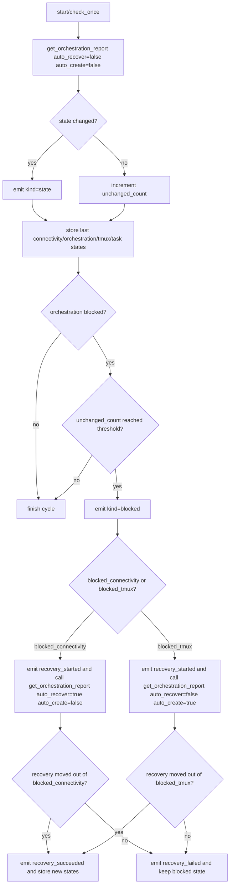

# HeartbeatMonitor 补充说明

> `HeartbeatMonitor` 仍然是底层机制，但它现在是可选高级能力，不是当前一问一答式 AI 的默认主路径。
> 它是 remote control 观察器，不是高层 experiment runner。

## 当前定位

旧版 heartbeat 以 `healthy / unhealthy` 为核心语义，主要回答“服务器好不好”。
重构后它改成了**状态流播报器 + 有界恢复协调器**，主要回答：

- 当前阻塞在 connectivity、tmux 还是 task 之前
- 状态有没有发生跃迁
- 是否已经开始一次 bounded recovery
- 这次 recovery 是成功、失败，还是仍然卡住

因此，heartbeat 的主输入不再是 `HealthReport`，而是 `OrchestrationReport`：

- `connectivity_state`
- `orchestration_state`
- `tmux_state`
- `task_state`
- `reason`

## 适用场景与边界

当前项目里要先区分两种使用模式：

- 一问一答式 AI：默认模式是每轮主动执行 `remote ensure/status` 与 `remote tasks capture`
- 持续进程或人工观察终端：才适合使用 `HeartbeatMonitor` / `remote monitor`

所以，heartbeat 不解决“AI 每轮能不能主动查状态”这个问题；那个问题仅靠主动轮询也能解决。
heartbeat 真正额外提供的是**连续上下文**：

- 连续多少轮仍停在同一阻塞态
- 什么时候该触发一次 bounded recovery
- 最近一次 recovery 的原因和结果

因此它只适用于这些场景：

- 触发远程重启后等待机器恢复
- 长时间任务期间持续观察是否从 `blocked_connectivity` 进入 `blocked_tmux`
- tmux session/window 尚未就绪时，等待 `auto_create` 推进到 `inspecting_task`
- 需要给外部自动化、长期进程或人工观察终端提供稀疏但高价值的状态变化事件

不适合让 heartbeat 自己承担这些职责：

- 决定当前项目该编哪个 kernel
- 判断当前 running kernel 是否满足 Chrono 实验目标
- 推进 pmbench 或结果处理流程
- 维护项目级“实验状态机”

如果只是当前对话里的 AI 每轮主动查一次状态，那么 `remote ensure/status + tasks` 往往已经足够，heartbeat 不是必须组件。

## 事件模型

heartbeat 现在产出结构化 `HeartbeatEvent`，而不是旧的 `(status, message)` 二元组。

关键字段：

- `kind`：`lifecycle` / `state` / `blocked` / `recovery_started` / `recovery_succeeded` / `recovery_failed`
- `connectivity_state`
- `orchestration_state`
- `tmux_state`
- `task_state`
- `unchanged_count`
- `recovery_state`
- `recovery_reason`
- `message`

典型 CLI 事件示例：

```text
[remote-event] profile=tsinghua kind=state connectivity=ready orchestration=blocked_tmux tmux=session_missing task=none unchanged=0 recovery=idle message="tmux session missing"
[remote-event] profile=tsinghua kind=recovery_started connectivity=ssh_unavailable orchestration=blocked_connectivity tmux=none task=none unchanged=3 recovery=inflight recovery_reason=ssh_unavailable message="recovery started: reason=ssh_unavailable"
[remote-event] profile=tsinghua kind=recovery_succeeded connectivity=ready orchestration=blocked_tmux tmux=session_missing task=none unchanged=0 recovery=succeeded recovery_reason=ssh_unavailable message="recovery succeeded: reason=ssh_unavailable"
```

## Heartbeat 内部流程图



## 最小 Python 示例

```python
from pathlib import Path
import time

from remote_server import HeartbeatConfig, HeartbeatEvent, HeartbeatMonitor, RemoteGateway

config_root = Path.cwd() / "config"
gateway = RemoteGateway("tsinghua", config_root=str(config_root))

def on_event(event: HeartbeatEvent) -> None:
    print(
        event.kind.value,
        event.connectivity_state.value,
        event.orchestration_state.value,
        event.tmux_state.value if event.tmux_state is not None else "none",
        event.message,
    )

monitor = HeartbeatMonitor(
    gateway,
    HeartbeatConfig(check_interval=15, max_retries=3, recovery_interval=30),
    on_event=on_event,
)

monitor.start()
try:
    time.sleep(60)
finally:
    monitor.stop()
```

## CLI 示例

```bash
uv run main.py remote monitor --profile tsinghua --interval 15
```

## 使用原则

- 先有明确的后台监控需求，再用 heartbeat
- 默认工作流优先记 `remote ensure + remote tasks`，不是 `remote monitor`
- 不要把 heartbeat 当作普通状态检查的默认入口
- heartbeat 只决定“要不要再尝试一次 recovery”，真正的 recovery 细节仍由 `RemoteGateway` 和各层 state machine 执行
- 真正的 BMC / reboot 动作仍受根 `AGENTS.md` 的安全约束
