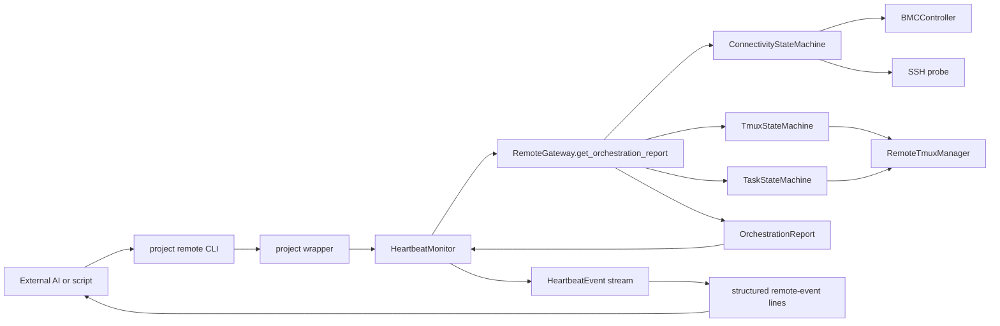
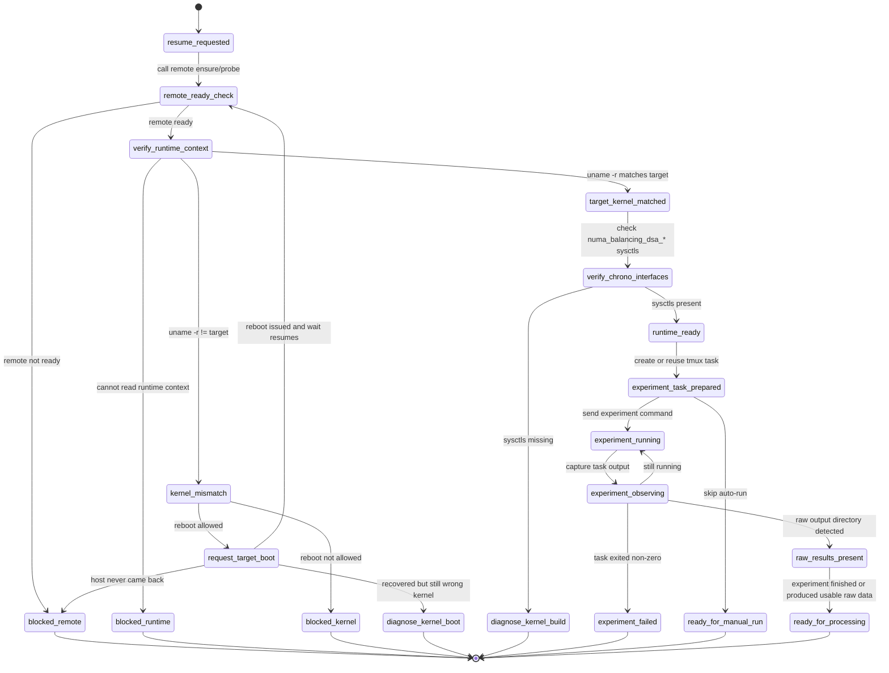

# Integration Guide

This toolkit is meant to sit under a project-specific remote CLI. The project
owns user-facing workflow semantics; the toolkit owns reusable remote control.

## Document Map

Read this file in this order:

1. Architecture and ownership boundary
2. Project-side integration steps
3. Stable APIs
4. Detailed operator demo
5. Heartbeat / monitor notes

The integrating project's top-level workflow doc should stay short and point
here for detailed examples and diagrams.

## Architecture

Keep the split explicit:

- project CLI: commands such as `profiles`, `status`, `health`, `ensure`,
  `monitor`
- toolkit facade: `RemoteGateway`
- toolkit transport layer: `RemoteTmuxManager`
- toolkit monitoring layer: `HeartbeatMonitor`

In Chrono this looks like:

```text
main.py remote -> scripts/remote_cli.py -> remote_server / remote_tmux
```

## Architecture Diagrams

These diagrams were previously duplicated in the Chrono project docs. They
belong here because they describe toolkit-backed control flow and the boundary
between project workflow semantics and reusable remote-control primitives.

### External AI Call Chain

This diagram shows the main call path when an external AI or script drives a
project-local remote CLI built on top of the toolkit.



### Project Workflow vs. Toolkit Boundary

This diagram is Chrono-specific in labels, but the boundary is the important
part: the toolkit only gets the machine to `remote ready`; project-specific
runtime checks and experiment sequencing stay outside the toolkit.



### Boundary Summary

- toolkit owns connectivity recovery, tmux readiness, task-window readiness,
  and heartbeat event streaming
- project code owns target-kernel expectations, runtime interface checks,
  benchmark sequencing, and result interpretation
- reboot recovery may be initiated through toolkit primitives, but deciding
  whether a recovered machine is the right runtime context remains a
  project-level concern

## Ownership Boundary

### What The Toolkit Should Own

- SSH/BMC readiness probes
- bounded connectivity recovery
- tmux session/window creation and inspection
- task-window state inspection
- heartbeat event streaming
- destructive-command blocking before tmux `send`

### What The Toolkit Should Not Own

- experiment sequencing
- benchmark-specific policies
- kernel version expectations
- result parsing or processing
- project-specific naming conventions

The removed `RemoteExperimentRunner` is the concrete example of this boundary:
it mixed reusable remote control with higher-level workflow assumptions and was
not part of the current stable control path.

## Project-Side Integration

### 1. Install the submodule

```bash
git submodule update --init --recursive
uv pip install -e external/remote-server-toolkit
```

### 2. Provide profile config

Create `config/remote_tmux/profiles.local.yaml` in the integrating project:

```yaml
profiles:
  tsinghua:
    ssh_target: Tsinghua_node198
    repo_path: ~/chrono-dsa
    session_name: chrono-ai-tsinghua
```

### 3. Build a project-local gateway

```python
from pathlib import Path

from remote_server import RemoteGateway

PROJECT_ROOT = Path(__file__).resolve().parents[1]


def build_gateway(profile: str) -> RemoteGateway:
    return RemoteGateway(profile, config_root=PROJECT_ROOT / "config")
```

This keeps profile resolution pinned to the repository config tree instead of
silently drifting to a global user config.

### 4. Use tmux commands through project wrappers

```python
from remote_tmux.manager import RemoteTmuxManager

manager = RemoteTmuxManager()
command = manager.build_send_command(profile, "build-kernel", "make -j32")
result = manager.execute(command, check=False)
```

The project wrapper remains responsible for:

- choosing repo-specific task names
- deciding whether to auto-`cd` into the repo
- presenting user-facing error messages
- deciding when `raw=True` is acceptable

## Current Stable APIs

Use these as the supported integration surface:

```python
from remote_server import (
    ConnectivityStateId,
    HeartbeatConfig,
    HeartbeatMonitor,
    OrchestrationStateId,
    RemoteGateway,
    TmuxStateId,
)
from remote_tmux import RemoteTmuxManager, load_remote_profiles
```

If deeper inspection of the state machines is needed, import directly from
`remote_server.state_machine` rather than relying on broad top-level re-exports.

## Reference Command Set

Chrono's stable remote path is:

```bash
uv run main.py remote profiles list
uv run main.py remote status --profile tsinghua
uv run main.py remote ensure --profile tsinghua
ssh Tsinghua_node198 'cd ~/chrono-dsa && <remote command>'
uv run main.py remote monitor --profile tsinghua --interval 10
```

That command set is the reference integration target. Anything beyond it should
be justified by a real project requirement, not by keeping legacy abstractions
alive.

## Detailed Demo

The project-side README should explain how operators are expected to use the
remote control plane. This document can hold the longer demo that explains what
the toolkit-backed commands are doing and when each path is appropriate.

### 1. Readiness check

```bash
uv run main.py remote profiles list
uv run main.py remote status --profile tsinghua
uv run main.py remote health --profile tsinghua
uv run main.py remote ensure --profile tsinghua
```

Use this sequence when starting work on a machine you have not touched in a
while.

- `status` is a short, read-only summary of orchestration semantics.
- `health` is a read-only compatibility diagnostic that expands the current
  state into `SSH/Tmux/BMC` health plus details.
- `ensure` is the readiness gate. It may recover connectivity and create the
  managed tmux session/window, and it only succeeds once the top-level
  orchestration state reaches `inspecting_task`.

### 2. Codex/agent path: one-shot remote commands over standard ssh

```bash
uv run main.py remote ensure --profile tsinghua
ssh Tsinghua_node198 'cd ~/chrono-dsa/kernel/chrono && make -j32'
```

This is now the preferred Chrono path for agent-driven work because it keeps
the command surface close to standard shell/ssh usage and does not depend on a
custom Codex shell backend.

Chrono's Codex hook layer then adds minimal safety checks on top:

- only configured SSH targets are allowed
- interactive ssh without a remote payload is denied
- obvious high-risk remote reboot/shutdown/formatting/raw-device-write payloads are denied
- safe `/dev/null` redirection and `dd ... of=/dev/null` are allowed

Minimal smoke test:

```bash
uv run main.py remote ensure --profile tsinghua
ssh Tsinghua_node198 'cd ~/chrono-dsa && printf "REMOTE_OK:%s\n" "$(hostname)"'
```

### 4. Monitor only when continuous observation matters

```bash
uv run main.py remote monitor --profile tsinghua --interval 15
```

This is not the default control path. It is useful for:

- reboot/recovery windows
- long-running compiles or experiments
- external automation that wants a sparse event stream

## Monitor Output Example

The current monitor output is a structured event stream derived from
`OrchestrationReport`, for example:

```text
[remote-event] profile=tsinghua kind=state connectivity=ready orchestration=blocked_tmux tmux=session_missing task=none unchanged=0 recovery=idle message="tmux session missing"
```

## Heartbeat / Monitor Notes

`HeartbeatMonitor` is a toolkit capability, not a required part of every
project-side remote workflow. Keep these boundaries explicit:

- one-shot AI or human interaction can usually rely on repeated
  `ensure/status/health` calls
- `monitor` is only needed when state transitions themselves need to be
  observed over time
- heartbeat should not own project-specific experiment sequencing
- deeper heartbeat/event-model details belong in toolkit docs and code, not in
  every integrating project's top-level workflow doc
